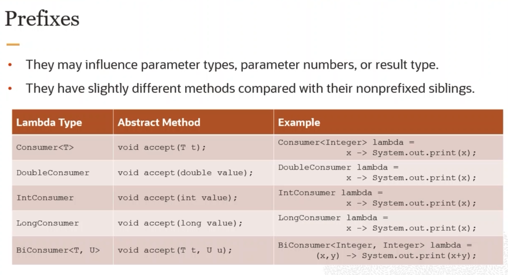
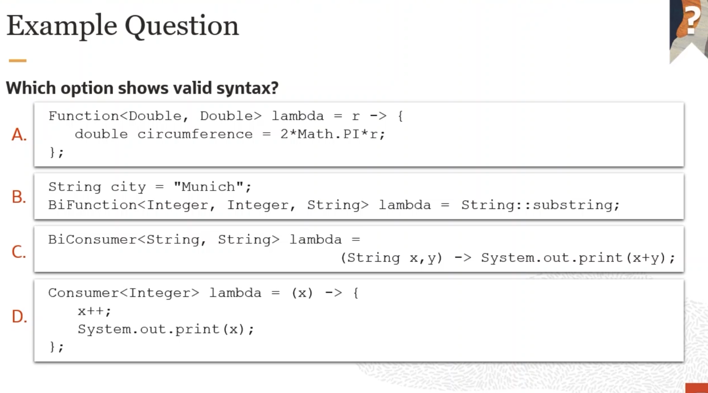

# 0z1 819 Lesson 10 Nested Class

# Nested Class
- 一個 Class 裡面有其他的 Class
  - 為了 Constrain the context
  - 為了 不讓其他地方 reuse code

有 3 種
1. static nested class => with static context
2. member inner class  => with instance context
3. local inner  class  
   1. in method class => 超少見
   2. Anonymous Inner Class => inside method (後來就被 Lambda 取代了)


# Static Nest Class
- 只能用 Static Variable 和 Method
- shared with all instance
- 可以用 OuterClass 和 Private Variable 和 Method
- inner Class 的 `this` 是指 inner class  而不是 Outer Class

```java
public class OuterClass { 
    static class InnerClass() {
        ...
    }
}
```

# Member Inner Class 
- 要求 Class 被一定的**順序**創建
- InnerClass 有 不能單獨出現的需求

```java
public class Outer {
    class Inner { 
        private Product product; // 這個可以直接被 Outer 看到
    }
}
```

## Local Inner Class
- 非常少
- 可能有 超複雜的 Algo 但不希望被 Reuse
- Outer Method 的 Param 只能是 Final

## Anonymous Inner Class
- 最常見的
- 只是為了 Override 一個 Method 或 Extend 一個 Method
  
```java
Order order = new Order() { // 事實上是 Extend 了一個 Order Class 但沒有 Class Name
    @Override
    public BigDecimal getDiscount() {

    }
}
```

# Lambda Expression 
- 可以減少 Anonymous Inner Class 的 Code

```java 
Collections.sort(products, new Comparator<Product>() {
    public int compare(Product p1, product p2) { // Lambda 不用看 Parameter 的 Type 也不用看
        return p1.getName().compareTo(p2.getName);
    }
})
// 會變成
Collections.sort(products, (p1,p2) -> p1.getPrice().compareTo(p2.getPrice()));
```

#### Lambda expression
```java
Consumer<String> lambda = x -> System.out.print(x); // 沒加 () {} 👌
Consumer<String> lambda = x -> { System.out.print(x); }; // 沒加 () 加 {} 👌 記得最後面要 ;
Consumer<String> lambda = x -> { 
    x = x + "Chocolate";
    System.out.print(x);
}; // 👌

// 有 Return 的
Supplier<Double> lambda = () -> Math.PI;
Supplier<Double> lambda = () -> { return Math.PI; };

// 可以標註 var 或 type **但如果要加就兩個都要加而且要一樣**
Comparator<Product> sortText = (String s1, String s2) -> s1.compareTo(s2);
Comparator<Product> sortText = (String s1, var s2) -> s1.compareTo(s2); // ❌

// 可以加 final， **但要加 var 或 Type**
Comparator<Product> sortText = (final String s1, String s2) -> s1.compareTo(s2);
```

### Predefine 和 Reuse
```java
Comparator<Product> sortText = (s1, s2) -> s1.compareTo(s2);
Collection.sort(list,sortText);
```

### Use Method Reference 
可以直接用 Class 或 Object 的 Method 當 Lambda
- `Class::staticMethod`     要是 `static` 的
- `object::instanceMethod`
- `Class::instanceMethod`   EX: `Collections.sort(List<String>, String::compareToIgnoreCase);`
- `Class::new`              用 constructor





#### Quiz

A. Function Type 一定要有 Return
B. Substring 是 Static Function
C. (String x, y) 👉 不能 implicit 和 宣告混在一起
D. Consumer 不用 Return

## Good reference
- [Java8 新特性教程](https://www.exception.site/java8)


