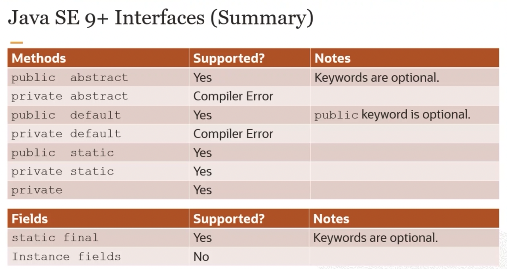

# 0z1 819 Lesson 7 Interface

# Interface
- 可以 Apply 到很多不一樣的 Class
- keyword `interface`
- 所有的 Variable 和 Method **預設** 都是 `abstract` 和 `public` （考）
- 可以有實體的 Module
  - 但必須是 `default` 或 `private`  或 `static` （考）
- 可以有 `constant` (final) 但不能有 Variable （考）
  - `public static final Period MAX_PERIOD = Period.ofDays(5)`
- interface 也可以 屙血案懂 from  interface
- interface 可以 extends 其他 interface
- interface 是種 `type`
- `default method` 只可以在 interface 裡（考）
- `default method`  可以在 `implement class` 裡 Override
- 如果 parent 有一樣的 Class name 則優先採用 parent 的
- interface 解決了實現**多重繼承**
  - Java 為什麼不能多重繼承？
    - 因為 Parent 之間的 Method 或 variable 會  conflict，但沒有機制解決
    - interface 可以讓 child 決定自己要用哪一個
- 如果沒有 interface conflict 就可以直接那 Default 用
- 如果有 conflict 要定義用什麼

```java
public interface TestClass {
    double a = 0.05; // 這個會自動被視為 static final
    default void add (){
        a += 0.1; // 這個會報錯
    }
}
```



### interface conflict
```java
interface A {
  public default void test() {}
}

interface B {
  public default void test() {}
}

class Testing implements A, B {
  public void test() {
    A.super.test(); // 這裡決定要用哪一個， 不然會報錯 （ Unresolved compilation problem ）
  }
}
```


# Functional Interface
- 為了解決
  1. 如果 impl 太多 interface，所有的 abstract 都要實現
  2. 不需要的 abstract 都要實現
  3. Keyword `@FunctionalInterface` 也是一種 Appendix
- 只有一種 Operation Function


# Generic
- 因為 Java 是 Strong Type, 想要讓所有的 Type 都能用的時候就可以 Generic
  - 例如 java.util.Comparator

用法 
```java
public class Some<T> { ... }
Some<Product> some = new Some<Product>();
Some<Product> some = new Some<> (); // 為了型態轉換的
```


# java.util.cloneable
- 一個沒有 Method Variable 的 Interface
  - public interface Cloneable{}
- `type maker` or `tag_interface`
- 可以用 if ( ... instanceof ... )
- `serializable` `runnable` 也是這類的


Question 會 Print 什麼
Ans: 3
```java 
interface A {
  public default void test() {
    System.out.println("interfaceA");
  }
}

interface B extends A {
  public default void test() {
    System.out.println("interfaceB");
  }
}

interface C {
  static void test() {
    System.out.println("interfaceC");
  }
}

class Testing implements A, B, C {}


public class App {
  public static void main(String[] args) throws Exception {
    var t = new Testing();
    t.test();
  }
}
```
1. interfaceA
2. interfaceB
3. interfaceC // 因為他只是 Static 不是 Default
4. 不會過


Question 哪裡會錯
```java
interface A {
  abstract void method();
}

abstract class B {

  abstract void method();
}

class Testing extends B implements A {

  public void test() {
    System.out.println("test");
  }

  void method() { // 會報 A 的 Access privilege 被 Narrow Down的錯
    System.out.println("balloons");
  }
}

```